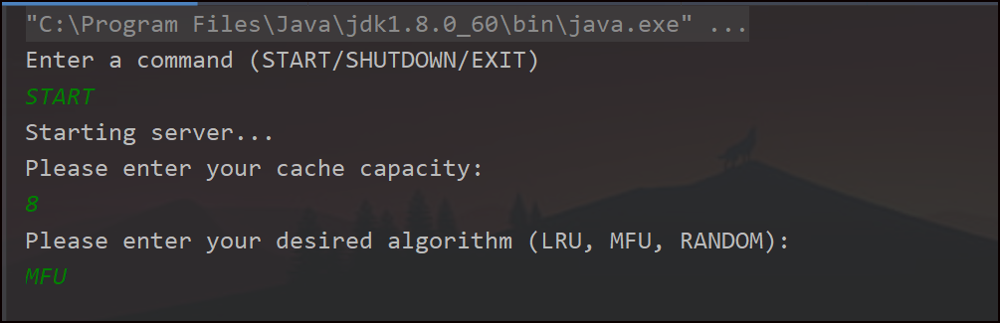
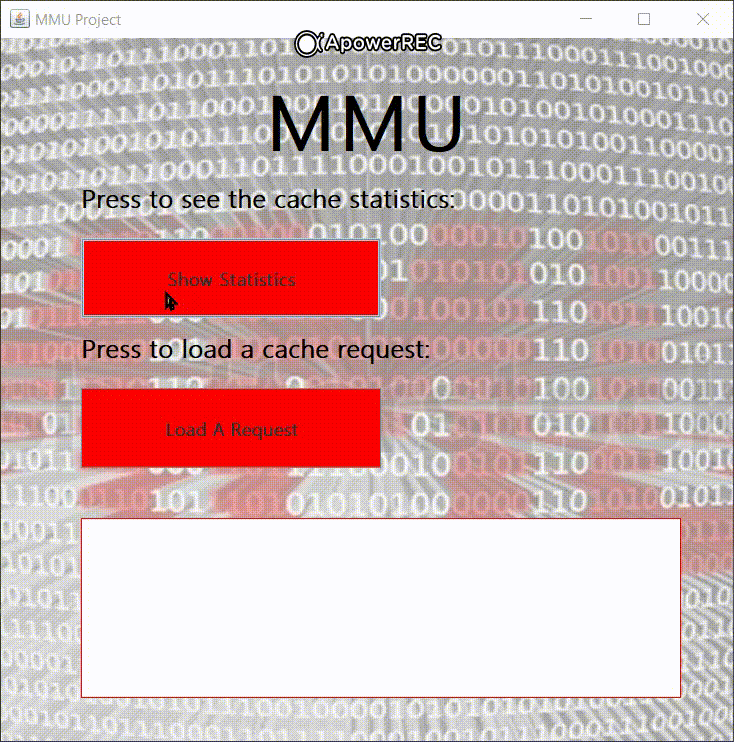

# MMU-project

## Java implementation of memory management unit.
Using client-server, design patterns, and replacement algorithms.

First run the server - in the `CacheUnitProject` directory, run the file `CacheUnitServerDriver`:

Then run the client - in the `CacheUnitClient` directory, run the file `CacheUnitClientDriver`:

